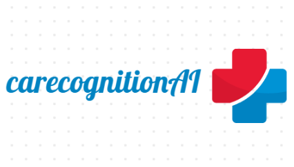
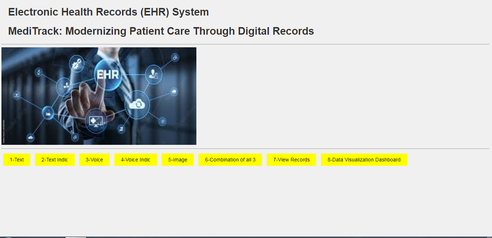

# DjangoCare: AI-Enhanced Electronic Health Record Platform
## CareCognition-AI-Powered-Digital-Health-Record-System
Introducing DjangoCare, an advanced electronic health record (EHR) system developed using Django and deployed on PythonAnywhere. Formerly known as CareCognitionAI during its development phase, DjangoCare has undergone numerous updates and enhancements, including the integration of hospital systems.
DjangoCare is a cutting-edge electronic health record (EHR) platform built using the Django web framework and deployed as a fully functional website on PythonAnywhere. This innovative system harnesses the power of artificial intelligence to revolutionize patient data management and enhance the quality of healthcare delivery.
A comprehensive platform that leverages AI to digitize and streamline patient health data. Supports text, voice, and image input across multiple languages, enabling efficient data entry. Includes an advanced data visualization dashboard for real-time health insights.

 
     


# [Watch it on youtube](https://youtu.be/gSpWPLMzYno?si=Ktf_vMZs5j8Td-8M)


# News
* 24/03/24 - The project has been deployed as fully functional website at [https://riian.pythonanywhere.com/] with Python Anywhere

# Main Page
 The Main Page of DjangoCare Platform has been displayed as follows,
 

# Technical Report

The project has been published as an technical report in **Open Science Framework**, to which the link is provided below.  
        
                        https://osf.io/pb4k2/?view_only=cb08335ed73c482bae351ba017ff17f3

# Citation

For now, cite the [Open Science Framework paper](https://osf.io/pb4k2/?view_only=cb08335ed73c482bae351ba017ff17f3):

```bibtex
@misc{vasudevan2024digitalhealth,
      title={Comprehensive Digital Health Record System: A Multi-Modal Approach with Text, Voice, and Image Recognition in Multiple Languages and Data Visualization Dashboard}, 
      author={Vasudevan Swornampillai},
      year={2024},
      month={March},
      publisher={Open Science Framework},
      doi={DOI 10.17605/OSF.IO/PB4K2}
}
```


# Input Modes

## Text Mode:
Allows for manual data entry, with a text Indic mode that supports input in multiple languages, including Marathi, Tamil, and Hindi.

## Text Indic Mode
The text Indic mode supports input in multiple languages, including Marathi, Tamil, and Hindi. This mode allows healthcare providers to input patient data in their preferred language, making the system more accessible and user-friendly.

## Voice Mode
The voice mode enables users to input data where the system read aloud the input fields through voice commands in English languages. This mode is ideal for healthcare providers who prefer to use voice commands or who have limited access to manual data entry or image recognition technology.

## Voice Indic Mode
The voice Indic feature reads aloud the input fields in Indic languages, providing better accessibility for healthcare providers who are visually impaired or have difficulty reading text.

## Image Mode: 
Utilizes Optical Character Recognition (OCR) technology to extract data from images, making it easier to digitize physical records.

## Flexible Combination: 
Supports a combination of all five modes, providing flexibility for users to choose the best input method based on their needs.

## View Records Mode:
The view-all-records feature enables healthcare providers to access and view all patient health records in one place. This feature is ideal for healthcare providers who want to access patient data quickly and efficiently.

## Data Visualization Dashboard
The data visualization dashboard allows healthcare providers to view and analyze patient data in real-time. The dashboard provides graphical representations of patient health data, making it easier to identify trends and make informed decisions.

# Key Features

### AI-powered Capabilities
* **Intelligent Data Processing**: The system leverages AI and machine learning techniques to intelligently process and manage patient health data.
* **Automated Data Extraction and Organization**: The platform's image mode and OCR capabilities automate the extraction and organization of data from physical records.
* **Advanced Analytics and Insights**: The system's data visualization and analysis features provide healthcare providers with advanced analytics and insights to support their decision-making processes.

### Data Visualization and Analysis
* **Real-time Data Visualization**: Offers a data visualization dashboard that allows healthcare providers to view and analyze patient data in real-time.
* **Graphical Representations**: Provides graphical representations of patient health data, making it easier to identify trends and support informed decision-making.
* **View-all-Records Feature**: Enables healthcare providers to access and view all patient health records in one place.
  
### Improved Efficiency and Patient Care
* **Streamlined Data Entry and Access**: Simplifies the process of entering and accessing patient data, improving the efficiency of healthcare providers.
* **Reduced Errors and Improved Accuracy**: The system's advanced data processing and management capabilities help reduce errors and improve the accuracy of patient records.
* **Enhanced Patient Care**: By providing a comprehensive and accessible digital health record system, the platform aims to enhance the overall quality of patient care.
  
### Scalability and Interoperability
* **Scalable Architecture**: The Comprehensive Digital Health Record System is designed to handle large volumes of patient data and accommodate the growing needs of healthcare organizations.
* **Interoperability**: The system is built with a focus on interoperability, allowing it to seamlessly integrate with existing healthcare IT infrastructure and systems.

# Installation and Setup

To install the Comprehensive Digital Health Record System, follow these steps:

1. Clone the repository onto your local machine using Git.
2. Install the necessary dependencies, including Python, Django, and MySQL.
3. Set up the database and configure the settings.py file.
4. Run the migrations to create the database tables.
5. Start the Django development server.
6. Access the system through a web browser.

# Usage and Documentation

To use the Comprehensive Digital Health Record System, follow these steps:

1. Log in to the system using your username and password.
2. Choose the input mode that best suits your needs.
3. Enter patient data into the system using the chosen input mode.
4. Access the data visualization dashboard to view and analyze patient data.
5. Use the view-all-records feature to access all patient health records in one place.

# Tech Stack 

**Language**: Python 3.10.12

**Django==5.0.2**: The Django web framework.

**numpy==1.26.4**: The NumPy library for scientific computing.

**pandas==2.2.1**: The Pandas library for data manipulation and analysis.

**pillow==10.2.0**: The Pillow library for image processing.

**pytz==2024.1**: The PyTZ library for handling time zones.

**requests==2.31.0**: The Requests library for making HTTP requests.

# Support and Contact

If you have any questions, please feel free to contact me at [vasudevanswornampillai@gmail.com].

# License

This project is licensed under the **Apache 2.0 License**.

# Under Deployment

"We are excited to announce that an exclusive feature, which will enable seamless integration with your existing hospital software systems, is currently under development. This forthcoming feature promises to enhance interoperability, streamline processes, and ultimately deliver superior patient care. Stay tuned for this transformative update!"

# Share with the community

If you find this project interesting or helpful, don't hesitate to share with your community! Let's learn and grow together!

# Conclusion

In this project, we’ve developed a robust solution for Digitizing health records. The model, a beacon of performance, awaits those go into the beautiful world of Python.
